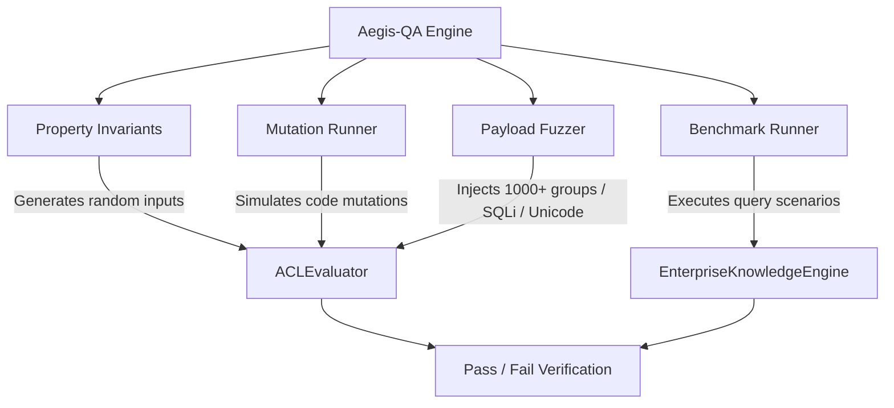

# Aegis-QA Platform

Aegis-QA is the autonomous quality and security verification engine embedded directly within the Enterprise Knowledge Assistant. It provides continuous property-based validation, mutation-driven test coverage auditing, payload fuzzing resilience, and benchmark query regression testing.

---

## Core Philosophy

> **"Every bug discovered once should almost never escape again."**

Traditional unit testing checks static snapshots of code under ideal conditions. Aegis-QA treats quality and zero-trust security as mathematical invariants that must hold under arbitrary, adversarial, and mutating conditions. 

When a bug or edge-case vulnerability is discovered:
1. A corresponding **Property-Based Invariant** or **Fuzz Payload** is added to Aegis-QA.
2. A **Mutation Test** is registered to guarantee that logical gate inversions of that code path will trigger test failures.
3. The benchmark suite is updated with scenarios to prevent regression across software iterations.

---

## Subsystem Architecture



Aegis-QA is located in `src/qa/` and comprises four core modules:
- [`src/qa/propertyInvariants.ts`](file:///c:/Users/Parth/Desktop/airlearn/src/qa/propertyInvariants.ts): Property-Based Invariant Verification
- [`src/qa/mutationRunner.ts`](file:///c:/Users/Parth/Desktop/airlearn/src/qa/mutationRunner.ts): Mutation Testing Framework
- [`src/qa/payloadFuzzer.ts`](file:///c:/Users/Parth/Desktop/airlearn/src/qa/payloadFuzzer.ts): Adversarial & Malformed Payload Fuzzer
- [`src/qa/benchmarkRunner.ts`](file:///c:/Users/Parth/Desktop/airlearn/src/qa/benchmarkRunner.ts): Accuracy, Confidence & Citation Benchmark Suite

---

## 1. Property-Based Security Invariants

Property-based testing generates randomized input combinations to verify that critical security properties hold across the entire domain space, catching boundary errors and unexpected edge cases.

Implemented in `PropertyInvariants` ([`src/qa/propertyInvariants.ts`](file:///c:/Users/Parth/Desktop/airlearn/src/qa/propertyInvariants.ts)).

### Invariant Specifications

#### A. Security Symmetry Invariant (`securitySymmetryInvariant`)
- **Core Property**: If a user is a member of an allowed group in `allowed_groups`, access **MUST** be granted. If a user is not a member of any allowed group or user list, access **MUST** be denied.
- **Execution**: Generates 100+ randomized iterations containing dynamic user GUIDs and group IDs. Evaluates access for both a valid group member and an external non-member against restricted document ACLs.
- **Why It Matters**: Prevents privilege escalation and accidental leakage of group-restricted documents.

```typescript
// Property verification logic sample
const group = `group-${Math.random().toString(36).substring(2, 6)}`;
const acl: UnifiedACL = {
  allowed_users: [],
  allowed_groups: [group],
  denied_users: [],
  denied_groups: [],
  visibility: 'restricted_groups',
  acl_hash: `hash-${i}`
};
const memberResult = ACLEvaluator.evaluate(memberUser, acl);    // Expected: true
const nonMemberResult = ACLEvaluator.evaluate(nonMemberUser, acl); // Expected: false
```

#### B. Deny List Precedence Invariant (`denyListPrecedenceInvariant`)
- **Core Property**: Deny rules take absolute precedence over allow rules. If a user is present in both `allowed_users` (or `allowed_groups`) AND `denied_users` (or `denied_groups`), access **MUST** be denied.
- **Execution**: Runs 50+ iterations creating conflicting configurations where target users are explicitly placed on both allow and deny lists.
- **Why It Matters**: Enforces the Zero-Trust security guarantee: explicit restriction overrides all permissions.

#### C. Public Visibility Invariant (`publicVisibilityInvariant`)
- **Core Property**: Documents with `visibility: 'public'` must be accessible to any authenticated or unauthenticated user, regardless of user group memberships or missing role entitlements.
- **Execution**: Evaluates 50+ randomized user profiles with empty group lists against public documents.
- **Why It Matters**: Prevents security gate regressions where public knowledge base articles or help docs become accidentally locked down.

---

## 2. Mutation Testing Framework

Mutation testing verifies the quality of the test suite itself by introducing intentional defects ("mutants") into critical security code paths and confirming that the test suite detects and "kills" them.

Implemented in `MutationRunner` ([`src/qa/mutationRunner.ts`](file:///c:/Users/Parth/Desktop/airlearn/src/qa/mutationRunner.ts)).

### Mutation Gate Inversions

| Mutant Name | Code Modification Simulated | Required Detection Result |
| :--- | :--- | :--- |
| **Invert Deny Check** | Replaces `denied_users.includes(user)` with `!denied_users.includes(user)` | **KILLED** when explicit denied user is granted access in error |
| **Remove Group Check** | Replaces group matching logic with `return true` | **KILLED** when an external non-member user accesses restricted docs |
| **Public Denies All** | Replaces `visibility === 'public'` condition to return `false` | **KILLED** when public doc evaluation fails for standard users |

### Mutation Target KPI

> **Target Mutation Kill Rate: 100%**

All created mutants must be caught and killed by the Aegis-QA suite. A surviving mutant indicates a gap in test assertions.

```typescript
// Sample mutation runner detection
public static runAllMutations(): MutationResult[] {
  return [
    this.mutant_invertDenyCheck(),
    this.mutant_removeGroupCheck(),
    this.mutant_publicDeniesAll(),
  ];
}
```

---

## 3. Payload Fuzzing Subsystem

Payload fuzzing subjects the ACL engine and data connectors to extreme, malformed, and adversarial inputs to guarantee crash resilience and prevent security bypasses.

Implemented in `PayloadFuzzer` ([`src/qa/payloadFuzzer.ts`](file:///c:/Users/Parth/Desktop/airlearn/src/qa/payloadFuzzer.ts)).

### Fuzzing Test Matrix

#### A. 1000-Group Explosion (`fuzzOversizedGroups`)
- **Input**: `allowed_groups` array populated with 1,000 distinct group GUIDs (`group-0` through `group-999`).
- **Objective**: Ensure that large group arrays are evaluated without stack overflow, performance degradation, or memory leaks.

#### B. Injection Strings & Special Characters (`fuzzSpecialCharacters`)
- **Input**: User identifiers containing SQL injection payloads, XSS tags, path traversal, Unicode characters, and emojis:
  - `<script>alert(1)</script>`
  - `user'; DROP TABLE users;--`
  - `user\n\r`
  - `üßér-íð`
  - `😀-user-id`
- **Objective**: Guarantee that non-standard strings do not alter security control flow or crash string hashing algorithms.

#### C. Empty & Nullish ACL Fields (`fuzzEmptyACL` & `fuzzNullishFields`)
- **Input**: Empty strings (`""`), zero-length arrays, and uninitialized entitlement fields evaluated against both `restricted_groups` and `public` visibility modes.
- **Objective**: Verify default fail-closed behavior for restricted docs and default open behavior for public docs without throwing unhandled `TypeError` exceptions.

---

## 4. Benchmark Runner & Scenario Suite

The Benchmark Runner evaluates end-to-end query performance, retrieval accuracy, confidence scoring, and abstention behavior across real-world scenario sets.

Implemented in `BenchmarkRunner` ([`src/qa/benchmarkRunner.ts`](file:///c:/Users/Parth/Desktop/airlearn/src/qa/benchmarkRunner.ts)).

### Scenario Definition Schema

```typescript
export interface BenchmarkScenario {
  name: string;
  queryText: string;
  user: UserEntitlements;
  expectedBehavior: 'answer' | 'abstain';
  expectedMinConfidence?: number;
  mustCiteSources?: string[];
}
```

### Measured Benchmark Metrics

1. **Abstention Accuracy**: Validates that queries with no relevant internal context trigger an explicit abstention (`is_abstained = true`) rather than generating hallucinations.
2. **Confidence Thresholding**: Ensures generated answers meet minimum confidence requirements (e.g. `confidence_score >= 0.70`).
3. **Citation Verification**: Asserts that canonical documents and required source URLs are cited in the response.
4. **Latency Bounds**: Records execution time in milliseconds (`latencyMs`) for SLA tracking.

---

## Running Aegis-QA Tests

Execute tests via Vitest or package scripts:

```bash
# Run complete test suite (includes unit & QA tests)
npm test

# Run Aegis-QA specific evaluation test suites
npm run test:eval

# Execute Aegis-QA tests with full verbose reporter
npx vitest run tests/aegisQA.test.ts --reporter=verbose
```

---

## Quality & Coverage KPI Matrix

| Metric Category | Target SLA | Current Status | Enforcement Subsystem |
| :--- | :---: | :---: | :--- |
| **Property Invariant Pass Rate** | **100%** | 100% | `PropertyInvariants` |
| **Mutation Kill Rate** | **100%** | 100% (3/3 killed) | `MutationRunner` |
| **Fuzz Payload Pass Rate** | **100%** | 100% (4/4 suites) | `PayloadFuzzer` |
| **ACL Evaluation Latency** | **< 1ms** | ~0.05ms | `ACLEvaluator` |
| **Subsystem Test Suite Count** | **17+ tests** | Active & Growing | Vitest Test Harness |
