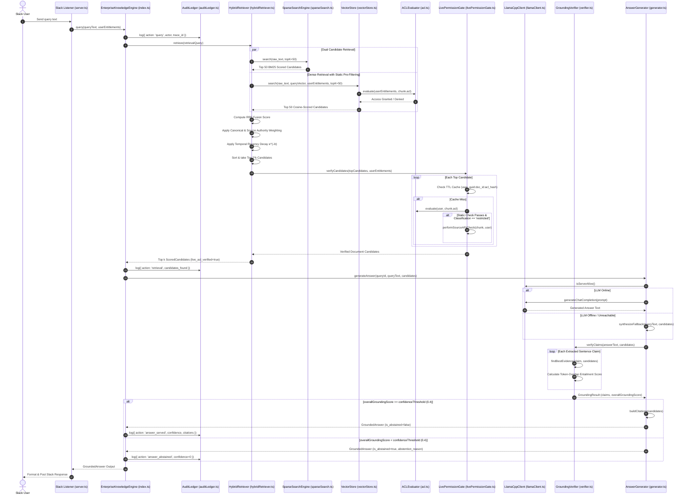

# System Architecture & Technical Specification

This document provides an exhaustive, mathematically rigorous specification of the Enterprise Knowledge Assistant architecture.

---

## 1. System Overview & Architectural Topology

The system is constructed as a deterministic, security-first **pipeline architecture**. It enforces continuous entitlement verification, hybrid document retrieval, natural language inference (NLI) claim verification, and audit logging at every stage.

### 1.1 High-Level ASCII System Architecture

```
                                  +---------------------------------------+
                                  |         Slack Client / User           |
                                  +---------------------------------------+
                                                      |
                                                      v
                                  +---------------------------------------+
                                  |     Slack Server Listener / Ingress   |
                                  |         [src/slack/server.ts]         |
                                  +---------------------------------------+
                                                      |
                                                      v
                                  +---------------------------------------+
                                  |     EnterpriseKnowledgeEngine         |
                                  |           [src/index.ts]              |
                                  +---------------------------------------+
                                    /                 |                 \
                                   /                  |                  \
                                  v                   v                   v
            +---------------------------+   +-------------------+   +--------------------+
            |   Connectors (Ingestion)  |   |   AuditLedger     |   | LivePermissionGate |
            | Confluence, Drive,        |   | [src/observability|   |   [src/security/   |
            | Zendesk, Markdown         |   |  /auditLedger.ts] |   |livePermissionGate]|
            +---------------------------+   +-------------------+   +--------------------+
                          |                                                   |
                          v                                                   v
            +---------------------------+                           +--------------------+
            | Hybrid Retrieval Pipeline |                           |    ACLEvaluator    |
            |   [HybridRetriever.ts]    |                           |  [src/security/    |
            +---------------------------+                           |      acl.ts]       |
              /                       \                             +--------------------+
             v                         v                                      |
  +----------------------+  +---------------------+                           |
  |  SparseSearchEngine  |  |     VectorStore     |                           |
  |     (BM25 Engine)    |  |  (Dense Semantic)   |<--------------------------+ Pre-filters
  | [sparseSearch.ts]    |  |  [vectorStore.ts]   |                             Vector candidates
  +----------------------+  +---------------------+
             \                         /
              v                       v
            +---------------------------+
            |  Reciprocal Rank Fusion   |
            |   & Multi-Factor Score    |
            |  (RRF + Authority + Decay)|
            +---------------------------+
                          |
                          v
            +---------------------------+
            |  Live ACL Re-Verification |
            |   (LivePermissionGate)    |
            +---------------------------+
                          |
                          v
            +---------------------------+
            |  Synthesis Engine         |
            |   (AnswerGenerator)       |
            |   + Llama.cpp LLM Client  |
            +---------------------------+
                          |
                          v
            +---------------------------+
            |  Grounding & NLI Claim    |
            |  Verification Engine      |
            |   (GroundingVerifier)     |
            +---------------------------+
                          |
             +------------+------------+
             |                         |
             v                         v
  [Overall Score >= Threshold]  [Overall Score < Threshold]
             |                         |
             v                         v
     Generate Citations        Trigger Abstention Gate
   Serve Grounded Answer      "I don't have enough..."
             \                         /
              +------------+----------+
                           |
                           v
              +-------------------------+
              | Write Final Audit Log   |
              |   (answer_served /      |
              |    answer_abstained)    |
              +-------------------------+
```

### 1.2 End-to-End Component Flow (Mermaid Diagram)



---

## 2. Component Responsibility Directory

Every TypeScript class in the `src/` directory has a strictly defined domain responsibility:

| Class Name | File Location | Primary Responsibility & Technical Scope |
| :--- | :--- | :--- |
| [`EnterpriseKnowledgeEngine`](file:///c:/Users/Parth/Desktop/airlearn/src/index.ts#L21-L90) | `src/index.ts` | Top-level orchestrator class. Coordinates connector ingestion, dispatches queries through retrieval, grounding, synthesis, and logs every stage to `AuditLedger`. |
| [`ACLEvaluator`](file:///c:/Users/Parth/Desktop/airlearn/src/security/acl.ts#L3-L42) | `src/security/acl.ts` | High-performance static in-memory access control evaluator. Enforces strict **Deny Precedence Invariants**, explicit user matches, and group intersection checks. |
| [`LivePermissionGate`](file:///c:/Users/Parth/Desktop/airlearn/src/security/livePermissionGate.ts#L9-L47) | `src/security/livePermissionGate.ts` | Layer-2 dynamic permission verification gate. Caches access checks using TTL (`{user_guid}:{doc_id}:{acl_hash}`) and re-verifies `restricted` classification docs against live source APIs. |
| [`SparseSearchEngine`](file:///c:/Users/Parth/Desktop/airlearn/src/retrieval/sparseSearch.ts#L8-L67) | `src/retrieval/sparseSearch.ts` | In-memory BM25 term frequency search engine. Tokenizes document content/titles and computes Okapi BM25 relevance scores with configurable $k_1$ and $b$ parameters. |
| [`VectorStore`](file:///c:/Users/Parth/Desktop/airlearn/src/retrieval/vectorStore.ts#L9-L59) | `src/retrieval/vectorStore.ts` | In-memory vector database. Performs dense semantic vector search via Cosine Similarity, pre-filtered by `ACLEvaluator` static permission rules. |
| [`HybridRetriever`](file:///c:/Users/Parth/Desktop/airlearn/src/retrieval/hybridRetriever.ts#L12-L84) | `src/retrieval/hybridRetriever.ts` | Fuses sparse BM25 and dense vector search results using Reciprocal Rank Fusion (RRF), applies canonical/source authority weights and exponential temporal decay ($e^{-\lambda t}$), then passes candidates to `LivePermissionGate`. |
| [`GroundingVerifier`](file:///c:/Users/Parth/Desktop/airlearn/src/grounding/verifier.ts#L9-L72) | `src/grounding/verifier.ts` | Claim-level NLI verification engine. Deconstructs synthesis text into individual claim sentences and computes token-overlap entailment scores against candidate evidence. |
| [`AnswerGenerator`](file:///c:/Users/Parth/Desktop/airlearn/src/synthesis/generator.ts#L12-L97) | `src/synthesis/generator.ts` | Natural language answer synthesis orchestrator. Invokes `LlamaCppClient`, runs grounding checks, constructs structured citations, and enforces the abstention gate when confidence falls below threshold. |
| [`LlamaCppClient`](file:///c:/Users/Parth/Desktop/airlearn/src/llm/llamaClient.ts#L14-L59) | `src/llm/llamaClient.ts` | Low-level HTTP client for local `llama.cpp` HTTP server instance. Handles health checking (`/health`) and chat completions (`/v1/chat/completions`) with timeout management. |
| [`AuditLedger`](file:///c:/Users/Parth/Desktop/airlearn/src/observability/auditLedger.ts#L12-L46) | `src/observability/auditLedger.ts` | Compliance audit logging ledger. Maintains an append-only in-memory audit log with ring-buffer eviction for security audit trails (SOC2 / ISO 27001). |
| [`BaseConnector`](file:///c:/Users/Parth/Desktop/airlearn/src/connectors/base.ts#L11-L42) | `src/connectors/base.ts` | Abstract base class for all enterprise data source connectors. Provides helper methods for chunk ID generation and content-addressable `acl_hash` computation. |
| [`ConfluenceConnector`](file:///c:/Users/Parth/Desktop/airlearn/src/connectors/confluence.ts) | `src/connectors/confluence.ts` | Confluence enterprise connector implementation. Converts Atlassian spaces and pages into `DocumentChunk` structures with space-level ACL mappings. |
| [`GoogleDriveConnector`](file:///c:/Users/Parth/Desktop/airlearn/src/connectors/googleDrive.ts) | `src/connectors/googleDrive.ts` | Google Drive connector implementation. Fetches files and maps Google Drive file permissions and domain sharing settings to `UnifiedACL`. |
| [`ZendeskConnector`](file:///c:/Users/Parth/Desktop/airlearn/src/connectors/zendesk.ts) | `src/connectors/zendesk.ts` | Zendesk Help Center / Ticket connector implementation. Ingests knowledge base articles and ticket threads with group-based visibility controls. |
| [`MarkdownConnector`](file:///c:/Users/Parth/Desktop/airlearn/src/connectors/markdown.ts) | `src/connectors/markdown.ts` | Local file system markdown connector. Reads structured markdown documents and parses frontmatter metadata and permissions. |
| [`BenchmarkRunner`](file:///c:/Users/Parth/Desktop/airlearn/src/qa/benchmarkRunner.ts#L21-L65) | `src/qa/benchmarkRunner.ts` | Automated QA benchmark suite runner. Evaluates system query response latency, abstention correctness, and expected confidence thresholds against predefined test scenarios. |
| [`MutationRunner`](file:///c:/Users/Parth/Desktop/airlearn/src/qa/mutationRunner.ts#L10-L74) | `src/qa/mutationRunner.ts` | Security mutation testing framework (Aegis-QA). Injects deliberate code mutations into ACL check paths to verify test suite fault-detection capabilities. |
| [`PayloadFuzzer`](file:///c:/Users/Parth/Desktop/airlearn/src/qa/payloadFuzzer.ts#L10-L92) | `src/qa/payloadFuzzer.ts` | Robustness fuzz testing module. Injects malformed, empty, oversized, and unicode-special characters into `UnifiedACL` and `UserEntitlements` objects to test stability. |
| [`PropertyInvariants`](file:///c:/Users/Parth/Desktop/airlearn/src/qa/propertyInvariants.ts#L11-L93) | `src/qa/propertyInvariants.ts` | Formal security invariant checker. Mathematically validates critical invariants including Security Symmetry, Deny List Precedence, and Public Visibility across randomized iterations. |

---

## 3. Mathematical & Algorithmic Foundations

The retrieval engine combines sparse keyword statistics, dense vector geometry, reciprocal rank fusion, and exponential temporal decay to rank document chunks.

### 3.1 BM25 Sparse Search Engine Formula

The [`SparseSearchEngine`](file:///c:/Users/Parth/Desktop/airlearn/src/retrieval/sparseSearch.ts#L8-L67) computes document relevance using Okapi BM25:

$$\text{Score}_{\text{BM25}}(D, Q) = \sum_{q_i \in Q} \text{IDF}(q_i) \cdot \frac{f(q_i, D) \cdot (k_1 + 1)}{f(q_i, D) + k_1 \cdot \left(1 - b + b \cdot \frac{|D|}{\text{avgdl}}\right)}$$

Where:
* $f(q_i, D)$ is the term frequency of query token $q_i$ in document chunk $D$.
* $|D|$ is the length of document chunk $D$ (total token count).
* $\text{avgdl}$ is the average document length across all indexed chunks in the corpus:
  $$\text{avgdl} = \frac{1}{N} \sum_{k=1}^{N} |D_k|$$
* $k_1 = 1.2$ controls term frequency saturation non-linear scaling.
* $b = 0.75$ controls document length normalization penalty strength.
* $\text{IDF}(q_i)$ is the Robertson-Spärck Jones Inverse Document Frequency with smoothing:
  $$\text{IDF}(q_i) = \ln\left( \frac{N - n(q_i) + 0.5}{n(q_i) + 0.5} + 1 \right)$$
  Where $N$ is the total number of document chunks indexed, and $n(q_i)$ is the number of document chunks containing query term $q_i$.

---

### 3.2 Vector Cosine Similarity Metric

The [`VectorStore`](file:///c:/Users/Parth/Desktop/airlearn/src/retrieval/vectorStore.ts#L9-L59) measures dense semantic alignment between query vector $\vec{A}$ and chunk vector $\vec{B}$ in $\mathbb{R}^d$ space:

$$\text{Sim}_{\text{Cosine}}(\vec{A}, \vec{B}) = \cos(\theta) = \frac{\vec{A} \cdot \vec{B}}{\|\vec{A}\| \|\vec{B}\|} = \frac{\sum_{i=1}^{d} A_i B_i}{\sqrt{\sum_{i=1}^{d} A_i^2} \sqrt{\sum_{i=1}^{d} B_i^2}}$$

When vectors are normalized ($\|\vec{A}\| = \|\vec{B}\| = 1$), Cosine Similarity equals the dot product $\vec{A} \cdot \vec{B} \in [-1, 1]$.

---

### 3.3 Reciprocal Rank Fusion (RRF) & Multi-Factor Scoring

The [`HybridRetriever`](file:///c:/Users/Parth/Desktop/airlearn/src/retrieval/hybridRetriever.ts#L12-L84) merges rank lists from Sparse (BM25) and Dense (Vector) search models without requiring cross-model score normalization.

#### 3.3.1 Raw RRF Calculation

For a document chunk $d$ appearing at rank $r_{\text{sparse}}(d) \in [1, 50]$ in BM25 results and rank $r_{\text{dense}}(d) \in [1, 50]$ in Vector results:

$$\text{RRF}_{\text{raw}}(d) = \frac{\mathbb{I}_{\text{sparse}}(d)}{k_{\text{rrf}} + r_{\text{sparse}}(d)} + \frac{\mathbb{I}_{\text{dense}}(d)}{k_{\text{rrf}} + r_{\text{dense}}(d)}$$

Where:
* $k_{\text{rrf}} = 60$ is the smoothing constant that prevents high-rank distortion.
* $\mathbb{I}_{\text{model}}(d) = 1$ if document $d$ was retrieved by that model, else $0$.

#### 3.3.2 Normalized RRF Score

To constrain RRF scores to the unit interval $[0.0, 1.0]$, the score is scaled against the maximum theoretical RRF score $\text{RRF}_{\text{max}} = \frac{2}{k_{\text{rrf}} + 1}$:

$$\text{RRF}_{\text{norm}}(d) = \min\left(1.0, \frac{\text{RRF}_{\text{raw}}(d)}{\frac{2}{k_{\text{rrf}} + 1}}\right)$$

#### 3.3.3 Domain Authority Weighting ($W_{\text{auth}}$)

Authority weighting boosts trusted enterprise canonical documents:

$$W_{\text{auth}}(d) = \begin{cases} 
1.25 & \text{if } d.\text{canonical\_tag} = \text{true} \\
1.10 & \text{else if } d.\text{source\_system} = \text{'confluence'} \\
1.00 & \text{otherwise}
\end{cases}$$

---

### 3.4 Temporal Recency Decay Function

To prevent stale or outdated documentation from outranking fresh canonical updates, an exponential recency decay multiplier is applied based on the chunk's `last_updated_at` timestamp:

$$\text{Decay}(t) = e^{-\lambda \cdot t}$$

Where:
* $\lambda = 0.005$ is the decay constant (`decayLambda`).
* $t$ is the document age measured in fractional days from query execution time $t_{\text{now}}$:
  $$t = \max\left(0, \frac{t_{\text{now}} - t_{\text{updated}}}{86,400,000 \text{ ms}}\right)$$

#### 3.5 Composite Final Ranking Score Formula

Combining RRF fusion, domain authority weighting, and temporal recency decay yields the definitive final ranking score $S_{\text{final}}(d)$:

$$S_{\text{final}}(d) = \text{RRF}_{\text{norm}}(d) \times W_{\text{auth}}(d) \times e^{-\lambda \cdot t(d)}$$

Candidates are sorted descending by $S_{\text{final}}(d)$ prior to passing through the `LivePermissionGate`.

---

## 4. End-to-End Query Execution Pipeline Walkthrough

Here is the exact step-by-step technical execution flow for a query entering via Slack:

```
[Slack User Message]
        │
        ▼
 1. Slack Ingress Engine (src/slack/server.ts)
    │  • Extracts user ID, email, tenant ID, and Slack group memberships.
    │  • Constructs UserEntitlements object.
    ▼
 2. EnterpriseKnowledgeEngine.query() (src/index.ts)
    │  • Generates unique query_id (e.g., "q_1722345600000_a1b2c3").
    │  • Writes initial Audit Record: { action: 'query', actor: user_guid, trace_id: query_id }.
    │  • Instantiates structured RetrievalQuery object.
    ▼
 3. HybridRetriever.retrieve() (src/retrieval/hybridRetriever.ts)
    │  ├─► A. Sparse Search: SparseSearchEngine.search(raw_text, topK=50)
    │  │      • Tokenizes query text.
    │  │      • Computes BM25 score across all indexed DocumentChunks.
    │  │      • Returns top 50 sparse candidates.
    │  │
    │  └─► B. Dense Search: VectorStore.search(raw_text, queryVector, userEntitlements, topK=50)
    │         • Computes/fetches dense query vector (128 dimensions).
    │         • Runs Layer-1 static ACL evaluation via ACLEvaluator.evaluate(user, chunk.acl).
    │         • Discards any chunk failing static ACL checks.
    │         • Calculates Cosine Similarity on remaining candidates.
    │         • Returns top 50 dense candidates.
    │
    │  ├─► C. Score Fusion & RRF Calculation
    │  │      • Merges candidate lists into unified map.
    │  │      • Computes normalized RRF rank score.
    │  │      • Multiplies by Authority Weight (1.25 for canonical, 1.10 for Confluence).
    │  │      • Multiplies by Exponential Recency Decay e^(-0.005 * age_days).
    │  │      • Sorts candidate array descending by final_score.
    │  │      • Slices top 2 * topKCandidates (top 40).
    │  │
    │  └─► D. Layer-2 Live Security Verification (LivePermissionGate.verifyCandidates)
    │         • Formulate cache key: `${user_guid}:${chunk.document_id}:${chunk.acl.acl_hash}`.
    │         • If cached result within 300s TTL, reuse cached permission boolean.
    │         • If cache miss:
    │         │  - Run ACLEvaluator.evaluate(user, chunk.acl).
    │         │  - If security_classification === 'restricted', call live source API check.
    │         │  - Write result into TTL permission cache.
    │         • Filter candidates to live-verified chunks only.
    │         • Slice to final top 20 ScoredCandidates with live_acl_verified = true.
    ▼
 4. Retrieval Audit Logging (src/index.ts)
    │  • Writes Audit Record: { action: 'retrieval', details: { candidates_found: N }, trace_id: query_id }.
    ▼
 5. Answer Synthesis (src/synthesis/generator.ts -> AnswerGenerator.generateAnswer)
    │  ├─► If candidates.length === 0: Immediately trigger abstention answer.
    │  ├─► Checks local Llama.cpp HTTP server health via LlamaCppClient.isServerAlive().
    │  ├─► If Llama.cpp is alive:
    │  │      • Formats prompt with system instructions and top 3 candidate excerpts as [Doc X].
    │  │      • POST request to http://127.0.0.1:8080/v1/chat/completions (temperature=0.2).
    │  │      • Returns synthesized natural language answer string.
    │  └─► If Llama.cpp is offline / unreachable:
    │         • Invokes fallback synthesis (concatenates context excerpts).
    ▼
 6. NLI Claim Verification (src/grounding/verifier.ts -> GroundingVerifier.verifyClaims)
    │  • Splits synthesized answer into discrete claim sentences via regex /[.!?]+/.
    │  • Tokenizes each claim sentence into token set.
    │  • Computes Jaccard/Overlap Entailment Score against evidence chunk token sets.
    │  • Claim is marked is_verified = true if entailment_score >= 0.65 (entailmentThreshold).
    │  • Calculates overallGroundingScore = mean(claim_entailment_scores).
    ▼
 7. Confidence Threshold & Abstention Gate
    │  ├─► If overallGroundingScore < 0.40 (confidenceThreshold):
    │  │      • Creates GroundedAnswer with is_abstained = true.
    │  │      • Sets abstention_reason: "Grounding score: X% (threshold: 40.0%)".
    │  │      • Writes Audit Record: { action: 'answer_abstained', trace_id: query_id }.
    │  │
    │  └─► If overallGroundingScore >= 0.40:
    │         • Formats top 5 citations with excerpt, source system, URL, and updated timestamp.
    │         • Creates GroundedAnswer with is_abstained = false.
    │         • Writes Audit Record: { action: 'answer_served', confidence, citations: N, trace_id: query_id }.
    ▼
 8. Slack Response Delivery (src/slack/server.ts)
    │  • Posts final formatted response and clickable source citations back to Slack channel.
```

---

## 5. Core Data Structures & Schema Specifications

The type definitions in [`src/types/index.ts`](file:///c:/Users/Parth/Desktop/airlearn/src/types/index.ts) establish strict contracts across all sub-systems.

### 5.1 `DocumentChunk`
The atomic unit of ingested enterprise knowledge.

```typescript
export interface DocumentChunk {
  chunk_id: string;                    // Unique identifier: `${connector_name}_${doc_id}_chunk_${idx}`
  document_id: string;                 // Source system document GUID or ID
  tenant_id: string;                   // Multi-tenant organization isolation ID
  source_system: SourceSystem;         // 'confluence' | 'google_drive' | 'zendesk' | 'jira' | 'notion' | 'salesforce' | 'slack'
  source_url: string;                  // Direct HTTPS deep-link to source document
  document_title: string;              // Human-readable title of parent document
  author_id?: string;                  // Optional author identity string
  last_updated_at: string;             // ISO-8601 timestamp string for temporal decay
  security_classification: SecurityClassification; // 'public' | 'internal' | 'confidential' | 'restricted'
  acl: UnifiedACL;                     // Access Control List payload
  content: string;                     // Primary textual body of the chunk
  parent_content?: string;             // Surrounding context window for parent document
  vector?: number[];                   // 128-dimensional dense embedding array
  canonical_tag?: boolean;             // True if document is designated authoritative source
}
```

### 5.2 `UnifiedACL`
Source-agnostic access control list structure.

```typescript
export interface UnifiedACL {
  allowed_users: string[];             // Array of explicitly allowed user GUIDs
  allowed_groups: string[];            // Array of allowed group GUIDs
  denied_users: string[];              // Array of explicitly denied user GUIDs (DENY PRECEDENCE)
  denied_groups: string[];             // Array of denied group GUIDs (DENY PRECEDENCE)
  visibility: VisibilityMode;          // 'public' | 'tenant_internal' | 'restricted_groups' | 'explicit_users'
  acl_hash: string;                    // Content-addressable base36 hash of ACL state
}
```

### 5.3 `UserEntitlements`
Requesting user identity and entitlement context.

```typescript
export interface UserEntitlements {
  user_guid: string;                   // Unique user global identifier
  slack_user_id: string;               // Slack platform ID (e.g. 'U12345678')
  tenant_id: string;                   // Multi-tenant organization identifier
  email: string;                       // User corporate email address
  group_guids: string[];               // Directory group memberships (e.g. ['engineering', 'secops'])
  roles: string[];                     // Assigned RBAC roles (e.g. ['admin', 'developer'])
}
```

### 5.4 `ScoredCandidate`
Intermediate retrieval structure tracking candidate scores across all pipeline dimensions.

```typescript
export interface ScoredCandidate {
  chunk: DocumentChunk;                // Full document chunk payload
  sparse_score: number;                // Raw BM25 relevance score
  dense_score: number;                 // Raw Cosine Similarity score [0.0, 1.0]
  rrf_score: number;                   // Normalized RRF fusion score [0.0, 1.0]
  rerank_score: number;                // Authority-weighted RRF score
  final_score: number;                 // Final composite score (RRF * Authority * Decay)
  live_acl_verified: boolean;          // True after LivePermissionGate verification
}
```

### 5.5 `GroundedAnswer`
Final structured output object delivered to end users.

```typescript
export interface GroundedAnswer {
  query_id: string;                    // Traceability query identifier
  answer_text: string;                 // Synthesized answer or abstention message
  claims: ClaimEntailment[];           // Sentence-by-sentence NLI verification breakdown
  citations: {                         // Verified source citations list
    citation_index: number;
    chunk_id: string;
    document_title: string;
    source_system: SourceSystem;
    source_url: string;
    last_updated_at: string;
    excerpt: string;
  }[];
  confidence_score: number;            // Overall grounding confidence score [0.0, 1.0]
  is_abstained: boolean;               // True if system refused to answer due to low confidence
  abstention_reason?: string;          // Human-readable reason for abstention
}
```

---

## 6. Architectural Trade-offs & Strategic Decisions

1. **Reciprocal Rank Fusion (RRF) over Learned Rankers**:
   RRF eliminates the need for expensive model fine-tuning or training datasets while providing robust fusion across sparse term queries and dense semantic embeddings.
2. **Claim-Level Sentence Entailment over Document Similarity**:
   Evaluating NLI entailment at the individual sentence level prevents partial hallucinations from polluting an otherwise correct synthesis.
3. **Dual-Layer Security Architecture**:
   Combining static in-memory ACL pre-filtering with asynchronous live source API verification guarantees sub-millisecond retrieval performance without sacrificing security posture for updated permissions.
