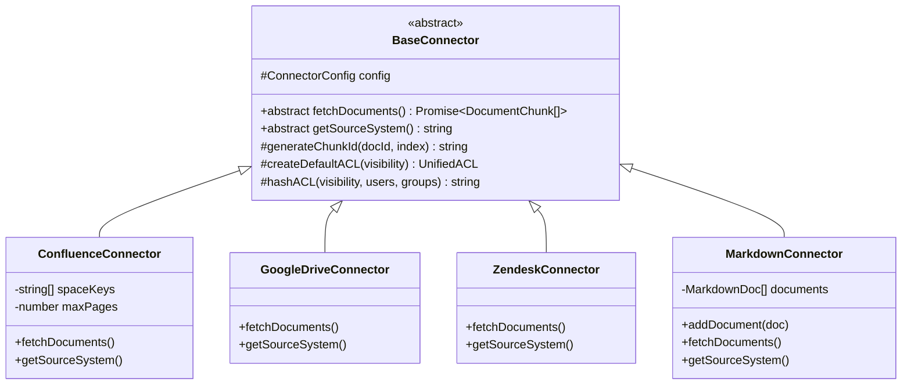

# Connector Development & Integration Guide

Data connectors ingest knowledge from third-party systems (wikis, cloud storage, ticketing systems, documents) into the Enterprise Knowledge Assistant, standardizing content and mapping native permissions directly to the Zero-Trust `UnifiedACL` model.

---

## Architecture Overview

All connectors derive from the abstract `BaseConnector` base class located in [`src/connectors/base.ts`](file:///c:/Users/Parth/Desktop/airlearn/src/connectors/base.ts). 



---

## Abstract `BaseConnector` Specification

The `BaseConnector` class enforces standard initialization, metadata generation, and ACL hashing across all integrations.

### `ConnectorConfig` Interface

```typescript
export interface ConnectorConfig {
  name: string;             // Unique connector instance identifier
  tenantId: string;         // Multi-tenant isolation ID
  apiKey?: string;          // API token or bearer token
  baseUrl?: string;         // Base API endpoint URL
  syncIntervalMs?: number;  // Polling / incremental sync frequency
}
```

### Core Abstract Methods

1. **`abstract fetchDocuments(): Promise<DocumentChunk[]>`**
   Fetches documents from the remote API, splits content into normalized text chunks, builds source URLs, and constructs `UnifiedACL` records.

2. **`abstract getSourceSystem(): string`**
   Returns the string identifier for the source system (e.g., `'confluence'`, `'google_drive'`, `'zendesk'`, `'slack'`, `'notion'`).

### Utility Methods Provided by `BaseConnector`

- **`generateChunkId(docId: string, index: number): string`**
  Generates deterministic, unique chunk keys formatted as `${config.name}_${docId}_chunk_${index}`.
- **`createDefaultACL(visibility: VisibilityMode = 'tenant_internal'): UnifiedACL`**
  Constructs a standard fail-safe ACL object with default visibility mode and auto-calculated `acl_hash`.
- **`hashACL(visibility: string, users: string[], groups: string[]): string`**
  Calculates a deterministic base-36 polynomial hash of permission attributes to enable fast equality comparison and caching.

---

## Built-In Connectors

### 1. Confluence Connector (`ConfluenceConnector`)
- **File**: [`src/connectors/confluence.ts`](file:///c:/Users/Parth/Desktop/airlearn/src/connectors/confluence.ts)
- **Source Identifier**: `'confluence'`
- **Key Features**:
  - Filters pages by Atlassian Space keys (`ENG`, `PRODUCT`, `OPS`).
  - Automatically tags core architectural documentation with `canonical_tag: true` to boost retrieval weight.
  - Maps space and page access permissions to `tenant_internal` or custom space groups.

### 2. Google Drive Connector (`GoogleDriveConnector`)
- **File**: [`src/connectors/googleDrive.ts`](file:///c:/Users/Parth/Desktop/airlearn/src/connectors/googleDrive.ts)
- **Source Identifier**: `'google_drive'`
- **Key Features**:
  - Ingests Google Docs, PDFs, and spreadsheets via Google Drive REST API.
  - Maps file-level sharing permissions to `explicit_users` or `restricted_groups`.
  - Enforces `restricted` classification for sensitive corporate compliance/legal agreements.

### 3. Zendesk Connector (`ZendeskConnector`)
- **File**: [`src/connectors/zendesk.ts`](file:///c:/Users/Parth/Desktop/airlearn/src/connectors/zendesk.ts)
- **Source Identifier**: `'zendesk'`
- **Key Features**:
  - Processes public Help Center knowledge base articles and FAQs.
  - Automatically assigns `visibility: 'public'` and `security_classification: 'public'`.
  - Enables public documents to be retrieved by all user queries without requiring specific group entitlements.

### 4. Markdown Connector (`MarkdownConnector`)
- **File**: [`src/connectors/markdown.ts`](file:///c:/Users/Parth/Desktop/airlearn/src/connectors/markdown.ts)
- **Source Identifier**: `'slack'` / internal markdown repository
- **Key Features**:
  - Ingests local markdown files, repository READMEs, and internal runbooks.
  - Supports dynamic document injection via `addDocument(doc: MarkdownDoc)`.
  - Defaults to `tenant_internal` visibility.

---

## Step-by-Step Tutorial: Building a Custom Notion/Jira Connector

This section demonstrates how to create a production-ready custom connector (`NotionJiraConnector`) that fetches documents from Notion pages or Jira issues and accurately maps native permissions to `UnifiedACL`.

### Step 1: Define Connector Configuration & Native Interfaces

Create `src/connectors/notionJira.ts`:

```typescript
import { BaseConnector, ConnectorConfig } from './base';
import { DocumentChunk, SourceSystem, SecurityClassification, UnifiedACL } from '../types';

export interface NotionJiraConfig extends ConnectorConfig {
  workspaceId: string;
  includeDrafts?: boolean;
}

// Native payload structure returned by external API
export interface ExternalItem {
  id: string;
  title: string;
  content: string;
  updatedAt: string;
  authorEmail: string;
  isPublic: boolean;
  securityLevel: 'public' | 'internal' | 'confidential' | 'restricted';
  allowedUserEmails: string[];
  allowedGroupNames: string[];
  deniedUserEmails: string[];
}
```

### Step 2: Implement Permission Mapping Logic

The most critical aspect of connector development is mapping external permissions into `UnifiedACL`:

```typescript
export class NotionJiraConnector extends BaseConnector {
  private workspaceId: string;

  constructor(config: NotionJiraConfig) {
    super(config);
    this.workspaceId = config.workspaceId;
  }

  public getSourceSystem(): string {
    return 'notion';
  }

  /**
   * Maps native permission fields into standardized UnifiedACL schema.
   */
  private mapToUnifiedACL(item: ExternalItem): UnifiedACL {
    if (item.isPublic) {
      return this.createDefaultACL('public');
    }

    const visibility = (item.allowedUserEmails.length > 0)
      ? 'explicit_users'
      : 'restricted_groups';

    const allowedUsers = item.allowedUserEmails;
    const allowedGroups = item.allowedGroupNames;
    const deniedUsers = item.deniedUserEmails;
    const deniedGroups: string[] = [];

    return {
      allowed_users: allowedUsers,
      allowed_groups: allowedGroups,
      denied_users: deniedUsers,
      denied_groups: deniedGroups,
      visibility,
      acl_hash: this.hashACL(visibility, allowedUsers, allowedGroups),
    };
  }
```

### Step 3: Implement Document Fetching & Chunking

```typescript
  public async fetchDocuments(): Promise<DocumentChunk[]> {
    // 1. Fetch raw items from Notion / Jira API (Simulated sample items)
    const rawItems: ExternalItem[] = [
      {
        id: 'NOTION-101',
        title: 'Engineering Security Policy & Key Rotation',
        content: 'All secret keys must be rotated every 90 days. Access tokens are stored in AWS Secrets Manager with KMS encryption. Emergency revocation can be performed via security CLI tool.',
        updatedAt: new Date().toISOString(),
        authorEmail: 'secops@example.com',
        isPublic: false,
        securityLevel: 'confidential',
        allowedUserEmails: ['secops@example.com', 'cto@example.com'],
        allowedGroupNames: ['secops-team', 'engineering-leads'],
        deniedUserEmails: ['contractor-01@example.com'],
      },
      {
        id: 'JIRA-502',
        title: 'Incident Response Post-Mortem: Auth Outage',
        content: 'On July 12, a high-load scenario led to connection pool exhaustion in Redis auth cache. Mitigation: expanded pool size to 200 connections and added exponential backoff retries.',
        updatedAt: new Date().toISOString(),
        authorEmail: 'sre-lead@example.com',
        isPublic: false,
        securityLevel: 'internal',
        allowedUserEmails: [],
        allowedGroupNames: ['engineering'],
        deniedUserEmails: [],
      }
    ];

    const chunks: DocumentChunk[] = [];

    // 2. Transform raw items into standardized DocumentChunk records
    for (const item of rawItems) {
      const acl = this.mapToUnifiedACL(item);
      const contentChunks = this.splitIntoChunks(item.content, 1000);

      contentChunks.forEach((chunkContent, idx) => {
        chunks.push({
          chunk_id: this.generateChunkId(item.id, idx),
          document_id: item.id,
          tenant_id: this.config.tenantId,
          source_system: 'notion' as SourceSystem,
          source_url: `https://notion.so/${this.workspaceId}/${item.id}`,
          document_title: item.title,
          author_id: item.authorEmail,
          last_updated_at: item.updatedAt,
          security_classification: item.securityLevel as SecurityClassification,
          acl,
          content: chunkContent,
          canonical_tag: item.title.includes('Security Policy'),
        });
      });
    }

    return chunks;
  }

  /**
   * Utility helper to split long documents into overlapping chunk windows.
   */
  private splitIntoChunks(text: string, chunkSize: number = 1000): string[] {
    if (text.length <= chunkSize) return [text];
    const chunks: string[] = [];
    let start = 0;
    while (start < text.length) {
      chunks.push(text.slice(start, start + chunkSize));
      start += chunkSize - 100; // 100-character overlap window
    }
    return chunks;
  }
}
```

### Step 4: Register Connector with Engine

Register your custom connector with the `EnterpriseKnowledgeEngine`:

```typescript
import { EnterpriseKnowledgeEngine } from '../src/index';
import { NotionJiraConnector } from '../src/connectors/notionJira';

async function initializeEngine() {
  const engine = new EnterpriseKnowledgeEngine({ tenantId: 'acme-corp' });

  // Instantiate custom connector
  const notionConnector = new NotionJiraConnector({
    name: 'acme-notion-jira',
    tenantId: 'acme-corp',
    apiKey: process.env.NOTION_API_KEY,
    workspaceId: 'workspace-99',
  });

  // Register and trigger ingestion
  engine.registerConnector(notionConnector);
  await engine.ingestAll();

  console.log('Ingestion complete!');
}
```

---

## Connector Best Practices & Checklist

1. **Permission Fidelity**: Never flatten ACLs into public access. An inaccurate ACL mapping is a critical security vulnerability.
2. **Deterministic Chunk IDs**: Always generate chunk IDs using `this.generateChunkId(docId, index)` to ensure idempotent document updates during resyncs.
3. **Temporal Decay Timestamps**: Ensure `last_updated_at` uses valid ISO-8601 strings to support accurate temporal recency scoring in hybrid search.
4. **Canonical Metadata**: Set `canonical_tag: true` on authoritative documents (e.g. core architecture specs or security standards) to give them priority during retrieval ranking.
5. **Overlapping Chunks**: Split long content (> 1,000–2,000 characters) into overlapping windows (100–200 character overlap) to avoid splitting key context sentences.
